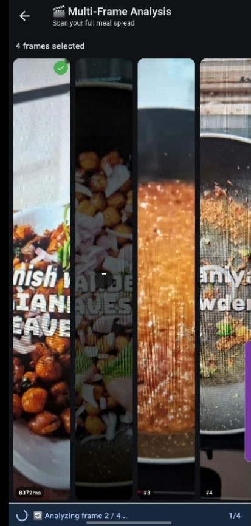

# NutriBuddy🥗 — AI Nutrition Coach powered by AMD GPU

> **AMD Challenge Submission** | Flutter · Gemini AI · AMD ROCm · Firebase

---

## 🎥 Demo

[](https://www.youtube.com/watch?v=LDbSWp8nCPM)

---

## Problem Statement

**Nutrition blindness is a global health crisis.** Over 2 billion people are either obese or malnourished — yet 90% have no idea what they're actually eating. Existing apps require tedious manual logging, ignore individual health profiles, and run entirely on centralised cloud AI — slow, expensive, and privacy-invasive.

**NutriBuddy solves this** by turning your phone camera into an instant AI nutritionist, with every inference optionally running locally on AMD GPU hardware — zero cloud dependency, full privacy, near-zero latency.

---

## App Screenshots

<table>
  <tr>
    <td align="center"><b>Sign-In Screen</b></td>
    <td align="center"><b>Welcome & Weekly Progress of User</b></td>
    <td align="center"><b>Food Logging & Daily Tracking</b></td>
    <td align="center"><b>Health Goals Selection</b></td>
    <td align="center"><b>Multi-Frame Meal Analysis</b></td>
  </tr>
  <tr>
    <td></td>
    <td></td>
    <td></td>
    <td></td>
    <td></td>
  </tr>
</table>

---

## AMD Hardware Integration

This is the core AMD differentiator in this submission.

### Local Inference via AMD ROCm + Ollama

The app ships an `AmdInferenceService` that auto-detects a local [Ollama](https://ollama.ai/) server running on an AMD GPU:

```
lib/services/amd_inference_service.dart
```

```dart
// Auto-detection at startup
final available = await AmdInferenceService.isAvailable();
// → pings http://localhost:11434/api/tags
// → verifies ROCm-backed Mistral model is loaded
// → gracefully falls back to Gemini cloud if unavailable
```

| Mode                | Backend                    | Latency      | Privacy        |
| ------------------- | -------------------------- | ------------ | -------------- |
| **AMD GPU Mode** ⚡ | Ollama + ROCm (Mistral 7B) | ~0.5 s local | 100% on-device |
| Cloud Fallback      | Google Gemini 2.5 Flash    | ~2–4 s       | Cloud          |

### Where AMD GPU Acceleration Shows Up

The `amdBackendAvailable` flag propagates across **every AI feature** in the app:

- **Chat assistant** — queries routed to local Mistral instead of Gemini
- **Multi-frame meal analysis** — processes each frame locally; no cloud round-trips, no quota burn — enabling near-real-time video-speed scanning
- **Smart Cart** — receipt OCR + nutrition scoring runs on-device
- **Supplement Optimizer** — stack analysis via local LLM
- **All screens** display an `⚡ AMD GPU` badge when local inference is active

### Quick Setup for AMD GPU Mode

```bash
# 1. Install Ollama with ROCm support
curl -fsSL https://ollama.ai/install.sh | sh

# 2. Pull the model on your AMD GPU
ROCR_VISIBLE_DEVICES=0 ollama pull mistral

# 3. Serve it
ROCR_VISIBLE_DEVICES=0 ollama serve

# 4. Run NutriBuddy — it auto-detects the backend
flutter run -d windows --dart-define=GEMINI_API_KEY=your_key
```

---

## What It Does — Feature Overview

### 1. Multimodal Food Analysis (Camera + Text)

Snap a photo or type a food name. Gemini Vision / local AMD model returns full nutrition breakdown — calories, protein, carbs, fats, sugar — with a goal-compliance score and personalised recommendations.

### 2. Multi-Frame Meal Spread Analysis

Capture multiple frames of a buffet, meal prep spread, or multi-dish table. The app sequences through each frame, aggregates nutrition, and generates an overall compliance report. With AMD GPU: zero cloud latency per frame.

### 3. AI Chat Nutrition Coach

Conversational coach with rolling 5-exchange memory. Routes intents automatically — food questions, recipe healthification, supplement queries, family meals — with no explicit menu navigation required.

### 4. Recipe Healthify

Paste any recipe → AI returns a healthier version with ingredient substitutions, calorie delta, and macro breakdown.

### 5. Cheat Meal Credit System

Gamified compliance tracker. The app scores the last 7 days of intake against your goals (0–100 pts), then unlocks a guilt-free cheat meal when you hit 70+. A novel engagement mechanic that drives daily retention.

### 6. Supplement Stack Optimizer

Browse 30+ supplements across 8 categories (Performance, Vitamins, Minerals, Omega/Fats, Gut Health, Sleep & Recovery, Weight Management). Select your stack → AI returns:

- Optimal daily timing schedule
- Synergy pairs (e.g. Creatine + Whey)
- Conflict / over-dosing warnings
- Missing supplements for your stated goals

### 7. Smart Grocery Cart

Scan a shopping receipt (photo) or type a list. AI scores each item against your daily goals, flags bad choices, and suggests healthier swaps.

### 8. Family Nutrition Hub

Add multiple family members with individual calorie/protein targets, allergies, and dietary restrictions. AI generates a unified weekly shopping list that satisfies every member simultaneously — including kid-friendly meal suggestions.

### 9. Personalised Daily Goals (BMR-based)

Health profile onboarding (age, gender, height, weight) feeds a Mifflin–St Jeor BMR calculation. Daily calorie and macro targets auto-adjust based on which health challenges are active.

### 10. Mood × Food Logging

After each meal analysis, the app asks how you felt. Mood logs are correlated with food choices over time to surface patterns.

### 11. Streak & Progress Dashboard

Weekly stats card on the welcome screen: days tracked, estimated fat loss / surplus, calorie deficit trend, and average protein. Drives daily app opens.

---

## System Architecture

```
┌──────────────────────────────────────────────────────────────┐
│                        Flutter UI Layer                      │
│   Chat · MultiFrame · SmartCart · Supplements · Family Hub   │
└──────────────────────┬──────────────────────┬───────────────┘
                       │                      │
           ┌───────────▼──────────┐  ┌────────▼──────────────┐
           │  AmdInferenceService │  │  Google Gemini 2.5    │
           │  Ollama + ROCm       │  │  Flash (cloud)        │
           │  localhost:11434     │  │  Vision + Text API    │
           │  Mistral 7B (local)  │  │                       │
           └───────────┬──────────┘  └────────┬──────────────┘
                       └──────────┬───────────┘
                                  │  Unified AI Response
                  ┌───────────────▼───────────────────┐
                  │          Firebase Layer            │
                  │  Auth — Google Sign-In + Anonymous │
                  │  Firestore — user data, history    │
                  │  Real-time streams (cart, mood)    │
                  └───────────────────────────────────┘
```

### Inference Routing Logic

```
User action (photo / text / feature)
        │
        ├─ amdBackendAvailable? ──YES──► AmdInferenceService.query()
        │                                 Mistral 7B via ROCm / Ollama
        └─ NO ──────────────────────────► GenerativeModel (Gemini 2.5 Flash)
```

The switch is **fully transparent** — same prompt format, same JSON response schema, identical UX.

---

## Tech Stack

| Layer              | Technology                                      |
| ------------------ | ----------------------------------------------- |
| Framework          | Flutter 3.x (Dart) — Android, iOS, Windows, Web |
| Local AI **(AMD)** | Ollama + ROCm — Mistral 7B on AMD GPU           |
| Cloud AI           | Google Gemini 2.5 Flash (vision + text)         |
| Authentication     | Firebase Auth — Google Sign-In + Anonymous      |
| Database           | Cloud Firestore (real-time sync)                |
| Local Storage      | `shared_preferences`                            |
| Image Picking      | `image_picker`                                  |

---

## Getting Started

### Prerequisites

- [Flutter SDK](https://docs.flutter.dev/get-started/install) ≥ 3.10
- [Firebase project](https://console.firebase.google.com/) — Authentication + Firestore enabled
- [Gemini API key](https://aistudio.google.com/app/apikey) (free tier works)
- **(AMD GPU mode)** AMD GPU with ROCm-compatible driver + Ollama installed

### Install & Run

```bash
git clone https://github.com/Harshcoder9/AMD-Challenge.git
cd "AMD-Challenge"
flutter pub get

# Standard cloud-AI mode
flutter run -d windows --dart-define=GEMINI_API_KEY=YOUR_KEY

# AMD GPU mode (requires Ollama + ROCm running locally — see above)
flutter run -d windows --dart-define=GEMINI_API_KEY=YOUR_KEY
# App auto-detects the local backend and shows ⚡ AMD GPU badges
```

> **Demo mode:** Omit `GEMINI_API_KEY` to run with fully simulated AI responses — no key or internet required.

For full Firebase setup see [FIREBASE_SETUP.md](FIREBASE_SETUP.md).

---

## Project Structure

```
lib/
├── main.dart                              # App entry, AMD backend check, chat routing
├── firebase_options.dart                  # Firebase project config
├── challenges_screen.dart                 # Health challenge selection
├── screens/
│   ├── sign_in_screen.dart                # Auth UI (Google / Guest)
│   ├── health_profile_screen.dart         # BMR onboarding
│   ├── settings_screen.dart               # Account + preferences
│   ├── video_analysis_screen.dart         # Multi-frame meal analysis
│   ├── smart_cart_screen.dart             # Grocery AI + receipt scan
│   ├── supplement_optimizer_screen.dart   # Stack optimizer (30+ supplements)
│   └── family_hub_screen.dart             # Family nutrition planner
└── services/
    ├── amd_inference_service.dart         # AMD ROCm / Ollama backend ⚡
    ├── auth_service.dart                  # Firebase Auth wrapper
    ├── firestore_service.dart             # Firestore CRUD + data models
    └── nutrition_calculator.dart          # BMR, macro & goal calculations
```

---

## Innovation Highlights

| What                                 | Why It Matters for AMD                                                                                      |
| ------------------------------------ | ----------------------------------------------------------------------------------------------------------- |
| **AMD GPU local inference**          | First nutrition app with on-device LLM path via ROCm — eliminates latency, cloud cost, and privacy concerns |
| **Multi-frame video-speed scanning** | AMD GPU removes per-frame cloud bottleneck — enabling real-time multi-dish analysis                         |
| **Graceful AMD ↔ cloud fallback**    | Works on any device; upgrades automatically when AMD hardware is present                                    |
| **Cheat credit gamification**        | Novel compliance mechanic — turns dietary adherence into a points game                                      |
| **Family-unified shopping list**     | Generates one list satisfying multiple members with conflicting dietary needs                               |

---

## Real-World Impact

- **Target users:** Anyone trying to eat better without the friction of manual logging
- **Core value:** Identify what you're eating in under 5 seconds with a camera
- **AMD hardware value-add:** Healthcare providers, gyms, clinics, and schools can run a private on-premise inference server on AMD hardware — no patient data ever leaves the building

---

## Future Roadmap

1. **On-device vision model** — run quantised LLaVA / MiniCPM-V via ROCm for fully offline image analysis
2. **Wearable integration** — Apple Watch / Fitbit step data → dynamic calorie goal adjustment
3. **Restaurant menu scanning** — point camera at a menu to get goal-ranked dish recommendations
4. **Social challenges** — compete with friends on streaks and goal hit-rate leaderboards
5. **Clinician dashboard** — dietitian portal with patient progress views (B2B pivot)
6. **In-app AI Grocery Cart Analyser extension** — a dedicated browser/store extension that overlays real-time nutrition scores and goal-compliance ratings directly on product listings in grocery delivery apps (Blinkit, Zepto, Amazon Fresh, etc.); powered by local AMD GPU inference so scores appear instantly without cloud round-trips, and synced back to the user's NutriBuddy daily totals seamlessly

---

## Firebase Security Rules (Production)

```javascript
rules_version = '2';
service cloud.firestore {
  match /databases/{database}/documents {
    match /users/{userId} {
      allow read, write: if request.auth != null && request.auth.uid == userId;
      match /{document=**} {
        allow read, write: if request.auth != null && request.auth.uid == userId;
      }
    }
  }
}
```

---

## License

Built for the AMD Challenge Hackathon. All rights reserved © 2026.
